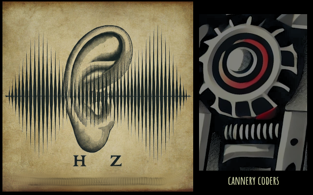

## info

`HzDemos` is a growing collection of demonstrations of the programmable
audio engine, [Hz](https://cannerycoders.com/Hz).  Here's you'll find
source-code for the demos.

We welcome you to visit the [live site](https://cannerycoders.github.io/HzDemos/)
and click around!

## credits

`HzDemos` was built by [Cannery Coders](https://cannerycoders.com).

## caveats

See [LICENSE.md](LICENSE.md).
